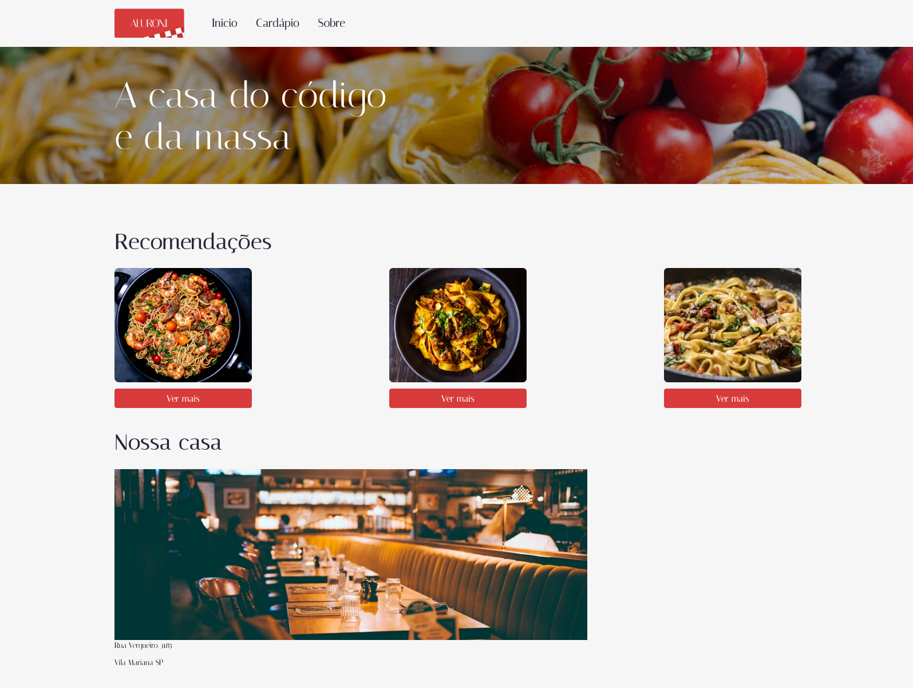
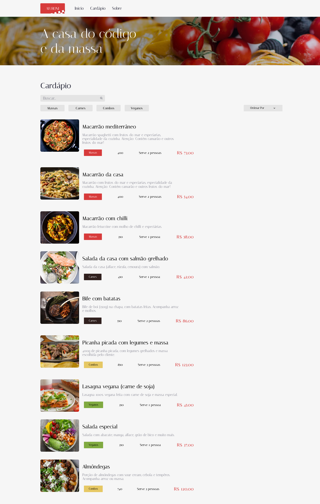
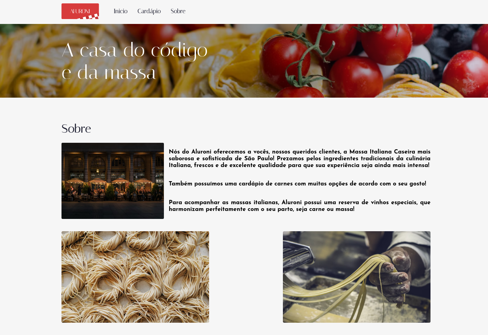

# react-site-restaurante

Esse projeto React escrito em typescript é uma cardapio de um restaurante que trás de forma dinâmica
as opções de pratos disponíveis

Ele é constituído em de três paginas

### Inicio



### Cardápio



### Sobre



## Dependências

## [React-router-dom](https://reactrouter.com/en/main)

As dependências utilizadas nesse projeto busca facilitar o desenvolvimento
e aumentar a agilidade.

O [react-router-dom](https://reactrouter.com/en/main) fica responsável por gerenciar a exibição das paginas
por meio das URLs "/", "/cardapio", "/sobre", toda a configuração de rotas se encontra no arquivo [src/routes.tsx](./src/routes.tsx),
nesse arquivo é feita a definição dos componentes de paginas a serem renderizados, Ex:

```
export default function AppRouter() {
  return (
    <main>
      <BrowserRouter>
        <Menu />
        <Routes>
          <Route path="/" element={<PaginaPadram />}>
            <Route index element={<Inicio />} />
            <Route path="cardapio" element={<Cardapio />} />
            <Route path="sobre" element={<Sobre />} />
          </Route>
        </Routes>
      </BrowserRouter>
    </main>
  );
}
```

Observe que o componente "<Menu />" esta fora da definição das rotas, isso acontece pois ele é um
elemento padrão de todas as paginas.

## [Sass](https://www.npmjs.com/package/sass)

Para maior organização e para aproveitar melhor o design de projeto css BEM, utilizei o [sass](https://www.npmjs.com/package/sass),
framework css que facilita a escrita de componentes modulares e reutilizáveis.

Com isso a parte estilização do site pode ser configurada e alterada sem dores de cabeça.
